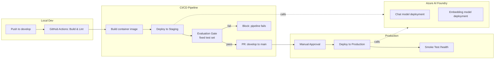

# vertex-rag-demo

A tiny RAG service deployed on **Azure AI Foundry**, shipped through a
**gated CI/CD pipeline**: every change is built, evaluated against a fixed
test set, deployed to staging, smoke-tested, and only then promoted to
production behind a manual approval gate.

The point of this project isn't the RAG app itself (it's deliberately
small) — it's the deployment architecture around it: environment
promotion, automated evaluation as a release gate, and an audit trail from
commit to deployed version.

## Architecture



## How it works

1. **App** (`app/`) — a minimal FastAPI service. `ingest.py` embeds a small
   local doc set into `index.json`; `main.py` retrieves the top matching
   chunks for a question and asks the deployed chat model to answer using
   only that context.
2. **Evaluation gate** (`eval/eval.py`) — runs a fixed set of questions
   against the staging endpoint after every deploy and checks for expected
   keywords, latency budget, and non-empty responses. A failing check
   blocks promotion to production — this is the same shape as Foundry's
   evaluation-as-a-gate pattern (quality/safety/groundedness checks before
   promotion).
3. **Pipeline** (`.github/workflows/deploy.yml`) — build → deploy staging →
   evaluate → (PR + manual approval) → deploy prod → smoke test. Production
   requires a GitHub Environment approval, so every prod change has a
   traceable commit, eval run, and approver.
4. **Infra** (`infra/deploy.sh`) — idempotent Azure CLI script that ensures
   the Foundry model deployments exist and pushes the new container image
   to Azure Container Apps.

## Setup

1. Create an Azure AI Foundry resource and project.
2. Create an Azure Container Registry and two Container Apps (staging,
   prod).
3. Add these GitHub repo secrets:
   - `AZURE_CREDENTIALS` (service principal JSON for `azure/login`)
   - `AZURE_RESOURCE_GROUP`
   - `AZURE_FOUNDRY_RESOURCE_NAME`
   - `AZURE_CONTAINER_REGISTRY`
   - `AZURE_CONTAINER_APP_NAME_STAGING`
   - `AZURE_CONTAINER_APP_NAME_PROD`
   - `STAGING_BASE_URL`, `PROD_BASE_URL`
4. In repo Settings → Environments, add a `production` environment with a
   required reviewer — this is what makes the prod deploy a manual gate.
5. Push to `develop` to trigger a staging deploy + eval; open a PR to
   `main` and merge to promote to production.

## Local run

```bash
export AZURE_AI_FOUNDRY_API_KEY=...
export AZURE_AI_FOUNDRY_ENDPOINT=...
export AZURE_CHAT_DEPLOYMENT=chat-deployment
export AZURE_EMBEDDING_DEPLOYMENT=embedding-deployment

pip install -r app/requirements.txt
python app/ingest.py
uvicorn app.main:app --reload
```

## Why this design

- **Evaluation as a release gate, not an afterthought** — a bad deploy
  never reaches production because it never passes staging eval.
- **Environment promotion, not direct-to-prod** — mirrors how regulated
  environments (e.g. pharma/healthcare) require staged rollout and audit
  trails for any production change.
- **Idempotent infra script** — re-running deploy.sh is safe, which
  matters once this pipeline runs on every merge.
